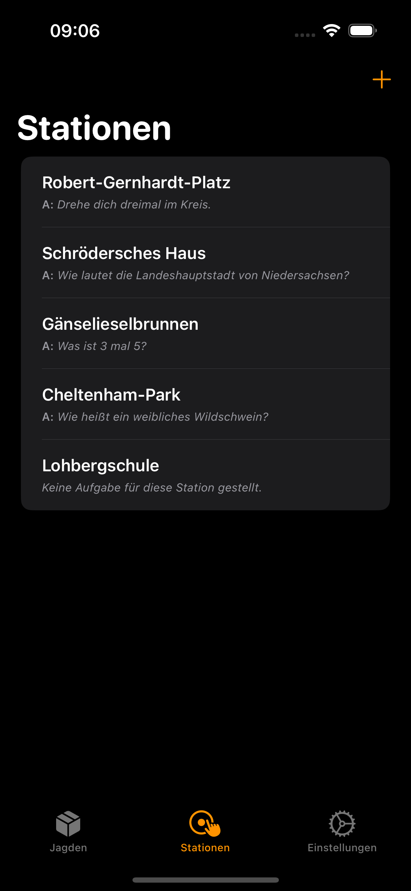
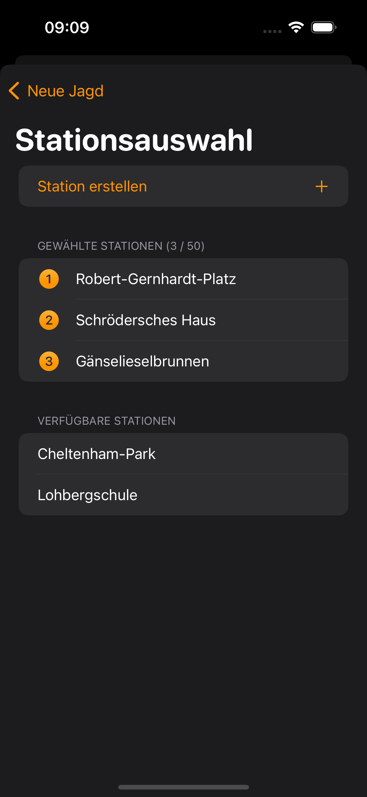
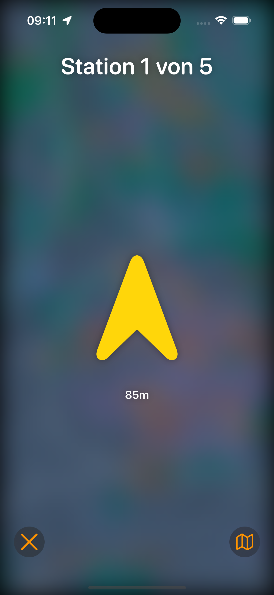
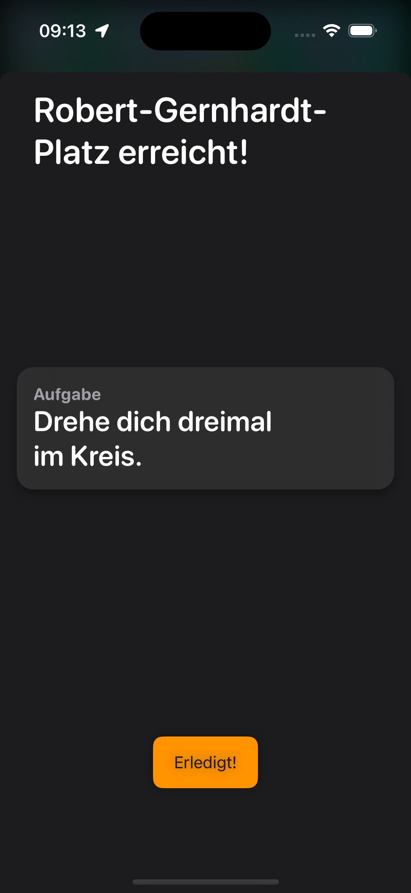

# TreasureHunt 🏴‍☠️

Start the treasure hunt now! Whether at a children's birthday party or a nice afternoon.

Create a few stations and let the kids search for them with the help of the arrow and the map!

If you come across this repository and want to try or help developing, it would be awesome if you test it: [TreasureHunt on TestFlight](https://testflight.apple.com/join/OD9uUu26)

## Features
- create stations to look for with a position on the map and, optional, a question that has to be answered at reaching the station
- with this stations you create a hunt that you can play
- the arrow points you to the next station, maybe there are multiple ways to get there
- but: look for the traffic and your environment first, when you hunt!

## Plans for the future
- possible different "questions" (multiple choice, maths, puzzle)
- sharing hunts, maybe you've created a exciting tour? Let other users try it.
- Live activity on the lock screen, close the app and follow the hunt from your lock screen!

## Screenshots

  
  
  
  

